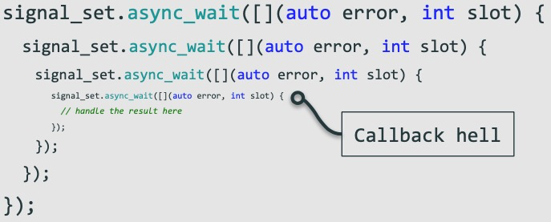
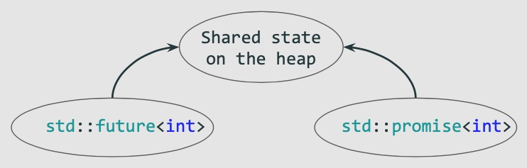
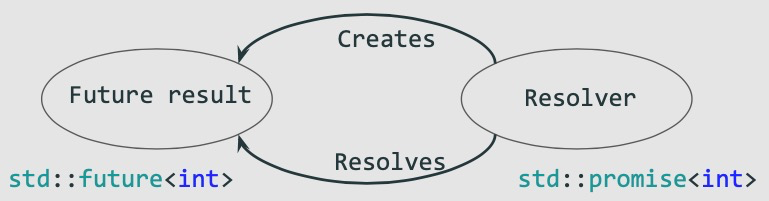

# Future文档

# 目录

* [背景和动机](#背景和动机)
* [基本概念](#基本概念)
* [快速示例](#快速示例)
* [如何创建future](#如何创建future)
* [获取future值](#获取future值)
* [线程策略](#线程策略)
* [异常处理](#异常处理)
* [WhenAll/WhenAny](#WhenAll/WhenAny)
* [RoadMap](#RoadMap)

# 背景和动机

## 标准库中future存在的问题
C++11标准中提供了std::future和std::promise，但是标准库的future无法实现链式调用，无法满足异步并行编程的场景。

## callback hell
在异步回调中继续调用异步接口，当异步调用嵌套层次很深的时候就形成了callback hell


我们需要一种更好的future来解决前面提到的两个问题，新的future将提供完备的异步并行场景的接口，这也是新future开发的动机。

# 基本概念

## future
表示一个异步返回的对象，还没有被计算的结果，一个未来的值。

## promise
一个异步返回对象(future)的创建者，也是移步结果的创建者，当promise设置值后会触发future取值的返回。

## 共享状态

promise和future共享一个内部状态(shared state)，future等待这个shared state的值，promise设置shared state的值。



## promise和future的关系
promise和future通过一个内部的共享状态关联，future等待共享状态的值，promise设置共享状态的值，可以把promise看作一个生产者，future看作一个消费者。



## Try<T>
表示的值可能是T也可能是一个异常，它用于future then链式调用的时候异常处理。

# 快速示例

## 链式调用

代码1-1：
```
  auto future = Async([]{
      return 42;
  }).Then([](int i){
    return i + 2;
  }).Then([](int x){
    return std::to_string(x);
  });

  std::string str = future.Get(); //44
```
future链式调用，Async和Then的回调函数都是在一个独立线程中运行的，我们也可以指定线程池。

## 指定线程池
代码1-2：
```
  boost::basic_thread_pool pool(4);
  auto future = Async(&pool, []{
    return 42;
  });

  auto f = future.Then(&pool, [](int i){
    return i+2;
  }).Then(&pool, [](int i){
    return i +2;
  }).Then([](int i){
    return i+2;
  });

  EXPECT_EQ(f.Get(), 48);
```

## 发起多个异步调用，等待所有的异步调用完成

代码1-3：
```
  std::vector<Future<int> > futures;
  futures.emplace_back(Async([]{return 42;}));
  futures.emplace_back(Async([]{return 21;}));

  auto future = WhenAll(futures.begin(), futures.end());
  std::vector<int> result = future.Get();
  auto r1 = result[0];
  auto r2 = result[1];

  EXPECT_EQ(r1, 42);
  EXPECT_EQ(r2, 21);
```

## 发起多个异步调用，等待任意一个移步操作完成。

代码1-4：
```
  std::vector<Future<int> > futures;
  futures.emplace_back(Async([]{return 42;}));
  futures.emplace_back(Async([]{return 21;}));

  auto future = WhenAny(futures.begin(), futures.end());
  std::pair<size_t, int> result = future.Get();
  auto which_one = result.first;
  auto value = result.second;

  EXPECT_TRUE((which_one == 0) || (which_one == 1));
  EXPECT_TRUE((value == 42) || (value == 21));
```

# 如何创建future

## 通过线程创建future

代码2-1：
```c++
  Future<int> f1 = Async([]{return 42;});
  EXPECT_EQ(f1.Get(), 42);

  Future<int> f2 = Async([](int i){return i + 2; }, 42);
  EXPECT_EQ(f2.Get(), 44);

  int GetVal(int i){
    return i + 2;
  }

  Future<int> f3 = Async(&GetVal, 42);
  EXPECT_EQ(f3.Get(), 44);
```

## 通过promise创建future

代码2-2：
```c++
  Promise<int> promise;
  Future<int> future = promise.GetFuture();
  promise.SetValue(42);
  EXPECT_EQ(future.Get(), 42);
```

## 根据一个值去创建future

代码2-3：
```c++
  Future<int> future = MakeReadyFuture(2);
  EXPECT_EQ(future.Get(), 2);
  EXPECT_TRUE(future.Valid());

  Future<void> void_future = MakeReadyFuture();
  EXPECT_TRUE(vfuture.Valid());
```

# 获取future值

## 一直等待直到获得值为止

代码2-4：
```c++
  auto future = Async([]{
    std::this_thread::sleep_for(std::chrono::milliseconds(50));
    return 1;
  });

  EXPECT_EQ(future.Get(), 1);
```

## 等待超时

代码2-5：
```c++
  auto future = Async([]{
    std::this_thread::sleep_for(std::chrono::milliseconds(50));
    return 1;
  });

  auto status = future.WaitFor(std::chrono::milliseconds(20));
  EXPECT_EQ(status, FutureStatus::Timeout);
  EXPECT_THROW(future.Get(), std::exception);
```

## 等待到某个时间点

代码2-6：
```c++
    auto future = Async([]{
      std::this_thread::sleep_for(std::chrono::milliseconds(50));
      return 1;
    }).Then([](int i){
      return i+2;
    });

    auto now = std::chrono::system_clock::now();
    auto status = future.WaitUntil(now + std::chrono::milliseconds(20));
    EXPECT_THROW(future.Get(), std::exception);
    EXPECT_EQ(status, FutureStatus::Timeout);
```
# 线程策略

## then的线程策略

### 同一线程同步then

代码2-7：
```c++
  auto future = MakeReadyFuture(std::this_thread::get_id());
  auto f = future.Then(Lauch::Sync, [](std::thread::id id){
    return id==std::this_thread::get_id();
  });

  EXPECT_TRUE(f.Get());
```

### 独立线程then

then默认是在独立线程中then， 见代码1-1

### 线程池中线程then

代码2-8：
```c++
  boost::basic_thread_pool pool(4);
  auto future = Async(&pool, []{
    return 42;
  });

  auto f = future.Then(&pool, [](int i){
    return i+2;
  }).Then(&pool, [](int i){
    return i +2;
  }).Then([](int i){
    return i+2;
  });

  EXPECT_EQ(f.Get(), 48);
```

## async线程策略

### 线程池中async
代码2-9：
```c++
  boost::basic_thread_pool pool(4);
  auto future = Async(&pool, []{
    return 42;
  });

  EXPECT_EQ(future.Get(), 42);
```

### 独立线程中async
默认Async在独立线程中，见代码1-1。

# 线程适配器

如果要用某个第三方的线程池，让它能和Async和Then结合使用该怎么做？

写一个线程适配器，通过一个submit方法来适配第三方的线程池。

代码2-10：
```c++
  ExecutorAdaptor<boost::basic_thread_pool> ex(4);

  auto future = Async(&ex, []{
    return 42;
  }).Then(&ex, [](int i){
    return i+2;
  });

  EXPECT_EQ(future.Get(), 44);
```

线程池适配器

代码2-11
```c++
template <typename E> struct ExecutorAdaptor {
  ExecutorAdaptor(const ExecutorAdaptor &) = delete;
  ExecutorAdaptor &operator=(const ExecutorAdaptor &) = delete;

  template <typename... Args>
  ExecutorAdaptor(Args &&... args) : ex(std::forward<Args>(args)...) {}

  void submit(std::function<void()> f) {
    ex.submit(std::move(f));
  }

  E ex;
};
```

# 异常处理

某个回调中发生了异常，对这个异常的处理要么就是直接抛出去，由外面捕获，还可以在下一个异步
链条中捕获这个异常，甚至可以继续传递这个异常到后续的异步链条中。Future库支持了这两种
异常处理的方式。

## 异步链条中捕获异常

代码3-1：
```c++
  auto future = Async([] {
    throw std::runtime_error("");
    return 1;
  });

  auto f = future
               .Then([](Try<int> t) {
                 if (t.HasException()) {
                   std::cout << "has exception\n";
                 }

                 return 42;
               })
               .Then([](int i) {
                 return i + 2;
               });

  EXPECT_EQ(f.Get(), 44);
```
代码3-1中通过Try对象捕获了异常之后选择了忽略该异常，继续执行后续的异步操作。

## 抛出异常

代码3-2
```c++
  Promise<int> promise;
  auto future = promise.GetFuture();
  auto f = future.Then([](int x){
    throw std::runtime_error("error");
    return x+2;
  }).Then([](int x){
    return x;
  });

  promise.SetValue(1);

  EXPECT_THROW(f.Get(), std::exception);
```
代码3-2没有通过Try对象来捕获异常，所以需要在外面try-catch，后面的Then异步调用不会执行。

# WhenAll/WhenAny

WhenAll除了支持容器之外，还支持了变参，即可以传入任意个类型不同的future。

## 变参版本的WhenAll

等待不同类型的future完成。

代码3-3：
```c++
  Promise<int> p1;
  Promise<void> p2;

  auto f1 = p1.GetFuture();
  auto f2 = p2.GetFuture();

  auto future = WhenAll(f1, f2);
  p1.SetValue(42);
  p2.SetValue();

  auto f = future.Then([](Try<std::tuple<Try<int>, Try<void>>>&& t){
    assert(std::get<0>(t.Value()).HasValue());
    auto result = t.Value();
    auto& r1 = std::get<0>(result);
    auto& r2 = std::get<1>(result);

    EXPECT_EQ(r1.Value(), 42);
    EXPECT_TRUE(r1.HasValue());
  });

  f.Get();
```

# RoadMap
1. 支持更多的异步操作函数；
2. 支持构建future表达式和图
3. 支持协程